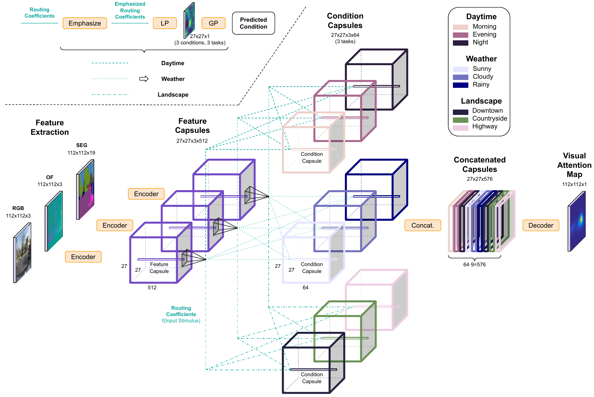

# GLCapsNet

Code for the paper entitled [Interpretable Global-Local Dynamics for the Prediction of Eye Fixations in Autonomous Driving Scenarios](https://ieeexplore.ieee.org/document/9275291), publicly available in IEEE Access. Supplementary material as videos and images will be provided along with the paper in the [IEEE Access site](https://ieeexplore.ieee.org/document/9275291).



Global-Local Capsule Network (**GLCapsNet**) block diagram. It predicts **eye fixations** based on several **contextual conditions** of the scene, which are represented as combinations of several spatio-temporal features (RGB, Optical Flow and Semantic Segmentation). Its hierarchical multi-task approach routes Feature Capsules to Condition Capsules both **globally and locally**, which allows for the **interpretation** of visual attention in **autonomous driving scenarios**.

## Docker environment

### How to use it?
* Install [nvidia-docker](https://github.com/NVIDIA/nvidia-docker)
* Configure [environment-manager.sh](environment-manager.sh):
    * *image_name*: the name of the Docker image
    * *data_folder*: the path to the storage (mounted as volume)
    * *src_folder*: the path to the local copy of this source code (mounted as volume)
* Run [environment-manager.sh](environment-manager.sh):
    * *service*: one of the service names defined at [docker-config.json](docker-config.json), with the path to the child Dockerfile and the tag of the CUDA base image to use.
    * *action*: what to do with the environment

### How to create a new environment?
* Update [docker-config.json](docker-config.json) with a new configuration
* Create a new child Dockerfile in the configured folder, [following the template for system](/system/Dockerfile)
* Create a new requirements.txt file is necessary

## Experiments

### How to run it?
* Generate the input features:
    * [Optical flow](https://github.com/feichtenhofer/gpu_flow)
    * [Semantic segmentation](https://github.com/bonlime/keras-deeplab-v3-plus)
* The usage is defined at [execute.py](/system/experiment/execute.py#L153):
    * *mode*: train, test (efficient computation of metrics), predict (sample-wise prediction for saving data to disk)
    * *feature*: rgb, of (optical flow), segmentation_probabilities (semantic segmentation)
    * *conv_block*: the kind of convolutional module to use from [conv_blocks.py](/system/models/conv_blocks.py)
    * *caps_block*: the kind of capsule-based module to use from [caps_blocks.py](/system/models/caps_blocks.py)
    * *experiment_id*: folder name of the experiment with datetime
    * *do_visual*: save visual predictions
* The execution generates the following:
```
/path_output_in_config/[all,rgb,of,segmentation_probabilities]/conv_block/caps_block/experiment_id/config_train.py
/path_output_in_config/[all,rgb,of,segmentation_probabilities]/conv_block/caps_block/experiment_id/checkpoints/weights.h5
/path_output_in_config/[all,rgb,of,segmentation_probabilities]/conv_block/caps_block/experiment_id/logs/tensorboard-logs
/path_output_in_config/[all,rgb,of,segmentation_probabilities]/conv_block/caps_block/experiment_id/logs/log.csv
/path_output_in_config/[all,rgb,of,segmentation_probabilities]/conv_block/caps_block/experiment_id/logs/trace_sampling.npy
/path_output_in_config/[all,rgb,of,segmentation_probabilities]/conv_block/caps_block/experiment_id/predictions/[test_id,prediction_id]/[resulting_files]
```
* Below it is described the training command to use per predefined config file (please note that the dataset and some other files must be generated first, and also the paths have to be adapted in each config file):
    * [00_branches](/configs/00_branches/config.py):
        * *rgb*: ```python3.6 execute.py -m train -f rgb --conv_block cnn_generic_branch```
        * *of*: ```python3.6 execute.py -m train -f of --conv_block cnn_generic_branch```
        * *segmentation_probabilities*: ```python3.6 execute.py -m train -f segmentation_probabilities --conv_block cnn_generic_branch```
    * [01_sf](/configs/01_sf/config.py): ```python3.6 execute.py -m train -f all --conv_block cnn_generic_fusion```
    * [02_gf](/configs/02_gf/config.py): ```python3.6 execute.py -m train -f all --conv_block cnn_generic_fusion```
    * [03_sc](/configs/03_sc/config.py): ```python3.6 execute.py -m train -f all --conv_block cnn_generic_branch --caps_block ns_sc```
    * [04_ns_sc](/configs/04_ns_sc/config.py): ```python3.6 execute.py -m train -f all --conv_block cnn_generic_branch --caps_block ns_sc```
    * [05_triple_ns_sc](/configs/05_triple_ns_sc/config.py): ```python3.6 execute.py -m train -f all --conv_block cnn_generic_branch --caps_block triple_ns_sc```
    * [06_mask_triple_ns_sc](/configs/06_mask_triple_ns_sc/config.py): ```python3.6 execute.py -m train -f all --conv_block cnn_generic_branch --caps_block mask_triple_ns_sc```
    * [07_mt_mask_triple_ns_sc](/configs/07_mt_mask_triple_ns_sc/config.py): ```python3.6 execute.py -m train -f all --conv_block cnn_generic_branch --caps_block glcapsnet```
    * [08_glcapsnet](/configs/08_glcapsnet/config.py): ```python3.6 execute.py -m train -f all --conv_block cnn_generic_branch --caps_block glcapsnet```

### How to create new models?
#### Same I/O schema
*  Keep the input features, conditions and targets as for the already developed models:
    * The I/O schema is defined as templates at [batch_generators.py:config_pipeline()](/system/utils/batch_generators.py#L188)
    * Create a new [conv_block](/system/models/conv_blocks.py) or [caps_block](/system/models/caps_blocks.py) at the corresponding class depending on the template required
    * Create new [capsule layers](/system/models/caps_layers.py)
    * Update model architectures at config files as they are defined dynamically via keywords
#### New I/O schema:
* Change the input features, conditions or targets:
    * Add a new I/O schema at [batch_generators.py:config_pipeline()](/system/utils/batch_generators.py#L188) based on the new requirements
    * Create a new model as defined above

#### Requirements
Model function names are required to be unique per conv_block or caps_block, as the code manage the executions via that names.


## Questions

Plese, any question or comment email me at **javiermcebrian@gmail.com**. I will be happy to discuss anything related to the topic of the paper.